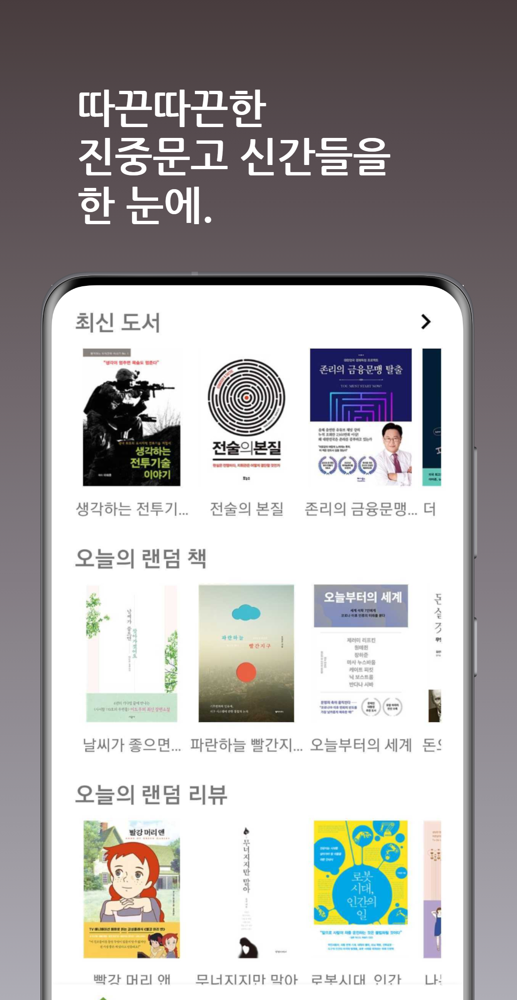
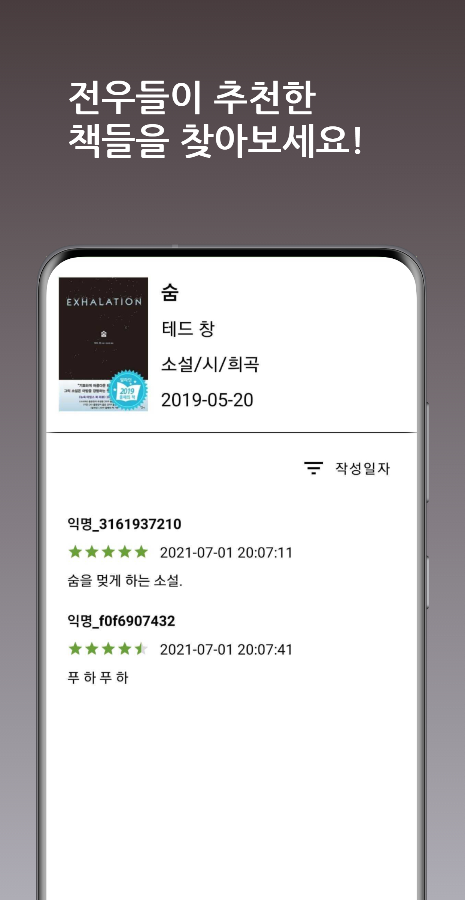
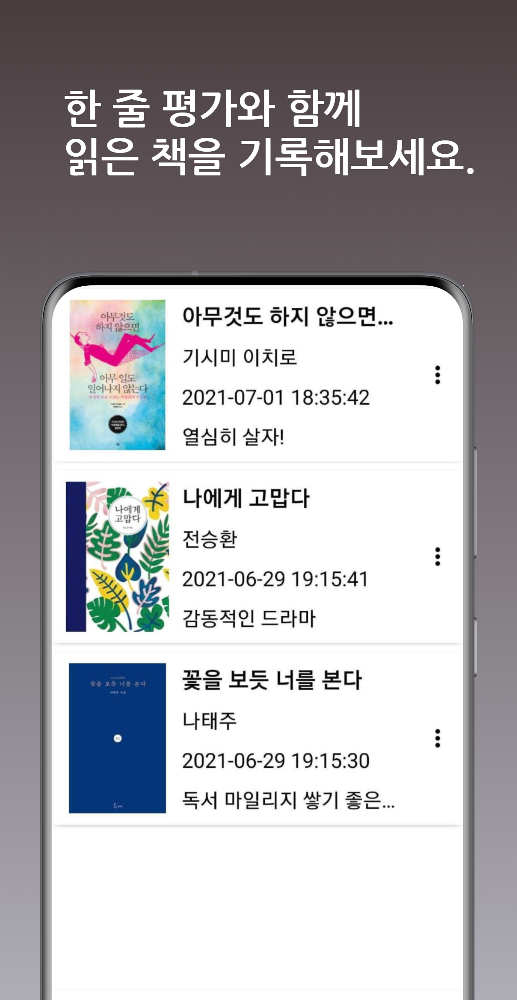

<p>
    <h1 align="center">
             MiliBrary
    </h1>
</p>

<p align="center">
    <a href="https://travis-ci.org/steverichey/google-play-badge-svg">
        
    </a>
    <a href="./license.md">
        
    </a>
</p>

<p align="center">
  • <a href="#about">About</a>
  • <a href="#usage">Usage</a>
  • <a href="#screen-shot">Screen shot</a>
  • <a href="#about-project">About project</a>
  • <a href="#license">License</a>
</p>


## About

수많은 진중문고 속 나에게 맞는 진중문고를 찾아주는 서비스를 제공하는 ‘밀리터리의 서재(MiliBrary)’입니다.

 밀리터리의 서재를 통해 같은 책을 읽은 장병들과 함께 서로 간의 흥미로웠던 주제에 관한 토론, 토의를 할 수 있고, 체계화된 독서 마라톤 시스템을 통해 더 쉽게 얼마나 완주했는지를 파악할 수 있는 환경을 추가로 제공할 수 있습니다.

- 따끈따끈한 진중문고 신간들을 한 눈에 볼 수 있습니다.

- 전우들이 추천한 책들을 찾아보세요!

- 한 줄 평가와 함께 읽은 책을 기록해 보세요!

## Usage

- 플레이스토에서 다운가능합니다!
<p align="center">
<a href="https://play.google.com/store/apps/details?id=dev.yunzai.milibrary">

</img>
</a>
</p>


## Screen shot
<p align="center">
        &nbsp;&nbsp;&nbsp;
        &nbsp;&nbsp;&nbsp;
        &nbsp;&nbsp;&nbsp;
        &nbsp;&nbsp;&nbsp;<br>
</p>

## About project

- 프로젝트 디자인 패턴 : MVVM
- 사용한 라이브러리
  - Retrofit : 네트워크 통신을 위한 라이브러리
  - Koin : Dependency Injection 라이브러리
  - Paginate : RecyclerView 페이징을 위한 라이브러리
  - Lottie :  Animation 을 위한 라이브러리
  - Hawk : 데이터를 암호화해서 SharedPreference에 저장하기 위한 라이브러리
  - RxJava, RxKotlin : 리액티브 프로그래밍을 위한 라이브러리

## License

```
Copyright 2021 yunjaena

Licensed under the Apache License, Version 2.0 (the "License");
you may not use this file except in compliance with the License.
You may obtain a copy of the License at

    http://www.apache.org/licenses/LICENSE-2.0

Unless required by applicable law or agreed to in writing, software
distributed under the License is distributed on an "AS IS" BASIS,
WITHOUT WARRANTIES OR CONDITIONS OF ANY KIND, either express or implied.
See the License for the specific language governing permissions and
limitations under the License.
```
